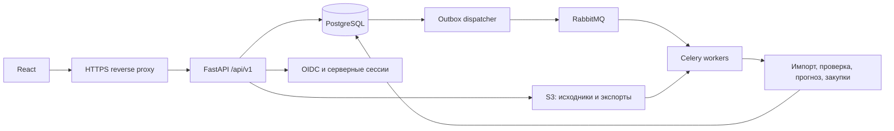

# Supply Planner: архитектура backend

Статус: архитектура продукта для промышленной эксплуатации; реализация ещё не начата. Основание: LOGISTICS_CASE.md, DATA_REVIEW.md и общие правила хакатона. Пользователь зафиксировал Python + FastAPI, React, PostgreSQL и Docker с первого этапа. Пятичасовой этап хакатона определяет порядок поставки функций, а не замену целевой инфраструктуры временными решениями. Готовность к эксплуатации подтверждается проверками, перечисленными ниже.

Название продукта: **Supply Planner**. Разбор предоставленного документа «Supply Planner: структура проекта» и сравнение с LEAFIO, Datup, REMIRA, SAP и Kinaxis — `PRODUCT_REVIEW.md`. Описанные в PDF статусы готовности не подтверждены кодом в этой рабочей директории.

## 1. Архитектурное решение

Модульный монолит: общая Python-кодовая база, независимо масштабируемые процессы FastAPI, Celery workers и dispatcher. PostgreSQL — источник истины для данных, заданий, рекомендаций и заказов. RabbitMQ доставляет задания; S3-совместимое объектное хранилище содержит исходные Excel и экспорты. Расчётное ядро не зависит от FastAPI, Excel, БД или LLM: получает типизированные данные и возвращает результаты.



Зафиксированный стек:

| Компонент | Решение |
| --- | --- |
| HTTP API и контракты | FastAPI, Pydantic, OpenAPI; клиентские типы React генерируются из контракта |
| База | PostgreSQL во всех окружениях, SQLAlchemy 2 + psycopg 3, миграции Alembic |
| Задания | Celery + RabbitMQ; состояния и результаты в PostgreSQL |
| Файлы | S3-совместимое хранилище, приватные объекты с версионированием |
| Обработка данных | pandas, NumPy, openpyxl для чтения; пакетная загрузка в PostgreSQL |
| Доступ | OIDC Authorization Code + PKCE через backend, серверные сессии, права по ролям и складам |
| Эксплуатация | Docker, HTTPS, отдельные окружения, CI/CD, метрики, централизованные логи, резервное копирование |

В API использовать async-сессии БД; Celery workers работают с собственными синхронными соединениями. Соединения создаются после запуска worker-процесса и не наследуются через fork. Сессия ограничена запросом/короткой транзакцией; нельзя держать её открытой во время чтения Excel или прогноза. Размер общего пула согласовать с лимитом соединений PostgreSQL и числом реплик. Версии зависимостей и образов закрепить при реализации.

CSV — первый формат экспорта, адаптер импорта в 1С добавляется по подтверждённому образцу. ORM-модели, доменные структуры и HTTP-схемы разделены. Redis не требуется для корректности; кэш допускается после измерений и всегда восстанавливается из основных источников.

## 2. Границы модулей

| Модуль | Ответственность | Результат |
| --- | --- | --- |
| ingestion | Определить тип файла по заголовкам, прочитать листы, сохранить исходные значения и координаты | Версия набора и нормализованные записи |
| quality | Проверить ключи, единицы, дубли, даты, покрытие источников и сверку сумм | Отчёт ошибок и возможностей набора |
| demand | Отделить возвраты/аномалии, оценить регулярный и упущенный спрос | Ряд спроса и журнал поправок |
| forecast | Учесть сезонность, устойчивый тренд, категорию и заданный сценарий роста | Прогноз на горизонт и оценка ошибки |
| replenishment | Учесть свободный запас, даты поставок, срок нового заказа, запас и MOQ/кратность | Рекомендованное количество и срочность |
| planning | Управлять заданием, параметрами и неизменяемым результатом расчёта | План с рекомендациями |
| orders | Создать заказы по поставщикам, принять правки и подтверждение | Версии заказов и журнал действий |
| exports | Выдать утверждённую версию в согласованном формате | Файл, связанный с версией заказа |

API-роуты валидируют запрос, вызывают сервис и возвращают DTO. Формулы не размещаются в роутерах. Импорт не рассчитывает заказ, экспорт не пересчитывает его.

## 3. Хранение и модель данных

Все импортированные факты привязаны к `dataset_id`; новый импорт не перезаписывает прошлый набор. Единица версии — комплект файлов и дополнений для выбранных поставщиков, с датой среза и версией парсера. Стабильная карточка товара отделена от снимка её атрибутов в наборе. Идентификаторы товаров храним строками, сохраняя ведущие нули и суффиксы. `organization_id` определяет область доступа, даже если первый запуск обслуживает одну компанию.

| Сущность | Ключевые поля и правила |
| --- | --- |
| Dataset / SourceFile | ID, статус, поставщики, дата среза, SHA-256 файлов, версии схемы/парсера, имена листов; файл хранится под серверным ID |
| Product / ProductSnapshot | Стабильный product_id; организация + поставщик + строковый code_1c; dataset + product_id фиксируют версию наименования, артикула, единицы и категории |
| Sale | product, warehouse_scope, timestamp, document_id, document_type, quantity, optional customer_id; исходный знак сохраняется |
| MonthlySale | product, warehouse_scope, month, quantity, period_complete; не складывается с Sale |
| InventorySnapshot | product, warehouse_scope, as_of, quantity, reserved, available, snapshot_kind; вид остатка обязателен |
| IncomingShipment | product, warehouse_scope, shipment_id, eta, quantity, unit; количество приводится к складской единице только при известном коэффициенте |
| SupplyTerms | product/supplier, lead_time_days, min_order_qty, order_multiple, purchase_unit, conversion_factor, source_kind |
| StockoutInterval | product, warehouse_scope, start, end, observed_or_estimated, method; факт и оценка раздельно |
| Seasonality / CategoryPolicy | поставщик/категория, месяц, коэффициент, происхождение и период расчёта; значение category_code не придумывает смысл категории |
| DataIssue | code, severity, source_ref, affected_product, message, required_action |
| Job / PlanningRun | status, stage, timestamps, heartbeat, dataset_id, parameters, algorithm_version, error, result_id |
| Recommendation | run_id, product, forecast, safety_stock, inventory, incoming, raw_qty, rounded_qty, quality_status, explanation_json |
| PurchaseOrder / OrderLine | supplier, run_id, status, revision, recommended_qty, approved_qty, reason, approved_by, approved_at |
| AuditEvent | actor, entity, action, timestamp, previous_revision, change summary |
| OutboxEvent / JobAttempt | Событие для доставки, подтверждение публикации, попытка задания, lease, heartbeat, fencing token |
| ProcurementCommitment | Обязательство по утверждённому заказу: product, scope, qty, expected_date, revision, состояние; отдельное от подтверждённой поставщиком поставки |
| ExternalOrderLink | order_revision, external_system, external_order_id, acknowledged_at; исключает повторный учёт заказа при следующем импорте из 1С |
| UserMembership / Session | OIDC subject, организация, роли, разрешённые склады; хеш случайного токена сессии, срок и отзыв |

`source_ref` содержит file_id, sheet, row и при необходимости column/range. Результат должен быть прослеживаемым до исходных ячеек. Объяснения и параметры хранятся в JSONB с версией схемы; фильтруемые количества, статусы и ключи — отдельными колонками. JSONB не заменяет внешние ключи и ограничения.

PostgreSQL: UUID для идентификаторов, TIMESTAMPTZ для событий, DATE для бизнес-дней/ETA, NUMERIC с согласованной точностью для денег и количества. Исходный часовой пояс дат продаж фиксируется при импорте; временные метки событий хранятся в UTC, бизнес-периоды определяются в часовом поясе склада. Произвольный timestamp из Excel не получает UTC без преобразования.

Ограничения БД: внешние ключи с областью организации; уникальность снимков, ревизий и результатов; положительная кратность/конверсия; неотрицательные количества заказа; допустимые даты интервалов. Проверки относятся к нормализованным данным, сырые некорректные значения сохраняются в staging для разбора. Индексы проектировать по запросам: организация/dataset/product/warehouse/date; run/supplier/status; organization/order/status. Импорт — COPY в staging и пакетная валидация, без отдельного INSERT на каждую строку. Партиционирование добавляется после измерения объёма и планов запросов.

Миграции только через Alembic, отдельным шагом релиза. Проверять развёртывание с пустой БД и обновление предыдущей версии. Изменения по схеме expand → migrate → contract сохраняют совместимость работающих API и workers. Удаление столбцов не совмещается с первым релизом, переставшим их читать.

Если склад не известен, использовать явно обозначенный общий охват источника. Не выдавать агрегат по компании за запас склада «Алматы». Точное сопоставление областей охвата — условие объединения данных.

## 4. Импорт существующих файлов

Два адаптера: `IekAdapter` и `SystemeAdapter`, по шесть распознаваемых типов входа. Имя файла помогает, но схема подтверждается заголовками. Существующие папки загружаются CLI тем же импортным сервисом, что и HTTP upload; приложение не требует произвольного доступа к пути от пользователя API.

Правила:

1. Загружать комплект в staging, выдать отчёт и активировать версию только после проверки. Неполный набор можно сохранить с ограниченными возможностями, но не скрывать недостатки.
2. Повторный импорт тех же файлов и настроек не размножает данные. Строки продаж не удалять только потому, что все значения совпали: одинаковые строки могут быть реальными позициями документа.
3. Месячные продажи и динамику сверить на общем диапазоне дат, товаров, единиц и складского охвата. Для каждого периода выбрать авторитетный источник. Вне подтверждённого пересечения не применять поправки из другой выборки.
4. Устранение дублей справочника: одинаковые записи объединить с сохранением ссылок; конфликтующие пометить. В пути различать повтор строки и разные поставки. Не складывать их вслепую.
5. Отрицательные продажи не превращать в положительные. Классифицировать документы по подтверждённым правилам; спорные корректировки сохранять отдельно.
6. Остатки IEK на начало месяца не использовать как актуальный свободный запас. Для текущего заказа нужен свежий снимок или явно введённое менеджером значение. При его отсутствии можно показать прогноз, но количество заказа — `null` с причиной.
7. Готовые формулы роста/сезонности и среднего из Excel сохранить для сравнения, а рабочие показатели пересчитать. В Systeme Electric уже найдено окно из 13 месяцев с делением на 12.
8. Пустота и ноль различаются. Пропущенная строка в пути становится нулём только при подтверждённой полноте отчёта; иначе это неизвестное значение.
9. Отдельный MOQ — предпочтительный кандидат для правил заказа, но минимальная отгрузка и кратность валидируются раздельно. Для бухт и метров обязателен перевод единиц.
10. Прогнозные коэффициенты конца 2026 года маркировать как внешние допущения. При исторической проверке нельзя использовать информацию, появившуюся после даты проверяемого прогноза.

## 5. Расчётный конвейер

### Регулярный спрос

Исходный ряд → классификация возвратов → кандидаты разовых крупных продаж → восстановление спроса в подтверждённые stockout-периоды → сезонность/тренд → прогноз.

Кандидатов аномалий оценивать по размеру документа относительно сопоставимых продаж товара, повторяемости и сезонного фона. Робастный порог служит признаком, а не доказательством: повторяющийся рост не удаляем. Для редких продаж нужен отдельный режим, где медиана и MAD могут быть нулевыми. Сохранять исходный объём, исключённый объём, основание и возможность ручного пересмотра.

Поддержать необязательный `customer_id` и тест на несколько крупных покупок одного клиента. В текущих выгрузках его нет: алгоритм документов не заявляется как полноценная клиентская агрегация.

По точным интервалам отсутствия оценивать спрос на основании периодов наличия и сопоставимого сезона. Месячные снимки допускают лишь отдельный режим приближённой оценки с пометкой; они не задают точное число дней stockout. Без интервалов не утверждаем, что обязательный сценарий на реальных данных полностью проверен. Дополнительные входные таблицы покрывают недостающие поля, синтетические тесты проверяют сам алгоритм.

### Прогноз

Базовая модель: робастная интенсивность продаж, нормированные сезонные множители и оценка тренда по сопоставимым полным периодам. Она служит проверяемой отправной точкой. Через интерфейс ForecastModel сравнивать кандидатов на последовательных временных срезах: сезонный наивный прогноз, экспоненциальное сглаживание, модель для прерывистого спроса и при достаточных данных модель с признаками. Ввод модели в эксплуатацию — по проверке ошибок и поведения закупок, без подбора на будущем периоде. Для короткой истории использовать категорию, затем поставщика, помечая источник оценки.

Контракт модели фиксирует дату среза, гранулярность и горизонт, состав/порядок признаков, версию подготовки спроса и требования к истории. Для дневных лагов проверять календарную сетку и свежесть данных; 14 строк не означают 14 последовательных дней. Ошибка оценивается на том же горизонте и тем же способом, что рабочий прогноз: рекурсивный многодневный расчёт проверяется без подмешивания фактического спроса внутри прогнозируемого окна. Метрики привязываются к модели, данным и временному срезу; R² не называется процентом точности. Успешность вызова LLM не влияет на оценку качества или интервал прогноза. Основание уточнений — `TECHNICAL_REFERENCE_REVIEW.md`.

Категория влияет через явную политику покрытия/запаса и доступный групповой сезонный профиль. Нерасшифрованные числовые категории не получают выдуманные правила. Внешний рост задаётся с периодом и режимом `replace_trend` или `additional_growth`, чтобы не учитывать один рост дважды.

Неполный сентябрь не сравнивается напрямую с полным месяцем. Дневная динамика учитывается до даты среза; месячный прогноз можно распределять по дням с явно указанным приближением. Страховой запас поддерживает две явные политики: заданные дни покрытия и квантиль ошибки спроса на период поставки при достаточной истории. Уровень обеспеченности задаётся по категории, статистическая политика должна пройти временную проверку калибровки. При нехватке данных применяется явно обозначенная политика дней покрытия; произвольная точность модели не заявляется.

### Количество заказа

На дату `as_of` имеем свободный остаток, прогноз по дням, ожидаемые поставки и срок нового заказа `L`. Горизонт покрытия `H = L + review_period_days`. Резервы вычитаются один раз: если источник уже даёт свободный остаток, повторно их не вычитаем.

Политика неудовлетворённого спроса задаётся явно: `lost_sales` или `backorder`. Для текущих данных использовать `lost_sales` как видимое допущение, поскольку обязательства клиентов не предоставлены; backorder требует отдельного источника и исключения двойного учёта с прогнозом. Дневная симуляция прихода и спроса показывает дату и объём риска до `L`; новый обычный заказ не может устранить этот прошлый дефицит.

Для дней от `L` до `H` симулировать базовый остаток без нового заказа. Потребность в новом заказе — минимальное количество, которое, будучи добавленным в дату `L`, устраняет провалы на этом интервале и обеспечивает целевой запас к концу горизонта. Позднее поступление не компенсирует более ранний провал задним числом. Поэтому одна формула с суммой всех поставок — только объяснение итога, а не достаточный алгоритм.

После перевода в закупочные единицы:

```text
если потребность <= 0: заказ = 0
иначе: заказ = ceil(max(потребность, минимальная_партия) / кратность) * кратность
```

Формула применяется только при известной положительной кратности. Избыточный запас из-за округления показывается отдельно. Если закупочная единица допускает дроби, используем Decimal и её точность; не округляем метры автоматически как штуки.

## 6. Объяснимость и ограничения данных

Каждая рекомендация возвращает числовую цепочку: исходные продажи, поправка на разовые заказы, оценка упущенного спроса, сезонность, рост, горизонт, страховой запас, свободный остаток, поставки по датам, потребность до/после MOQ. Текст строится по шаблону из этих значений.

Учебный пример объяснения: «На горизонт нужно 120 шт., страховой запас 20, доступно 30, своевременно поступит 40: базовая потребность 70; при кратности 12 рекомендовано 72». Это иллюстрация, не результат обработки текущих файлов.

Статусы строки: `ready`, `estimated`, `needs_input`, `excluded`. Неизвестное количество — `null`, не 0. Риск дефицита и полнота данных — разные показатели. Не выдавать произвольный процент уверенности без калибровки.

Сводка плана показывает количество рассчитанных и заблокированных позиций и причины. Для утверждения `needs_input` сначала требуется ввод данных или исключение строки. Для `estimated` менеджер подтверждает конкретные допущения; они остаются в заказе.

## 7. HTTP-контракт для React

Базовый префикс `/api/v1`. ID — непрозрачные идентификаторы. Объёмные списки имеют пагинацию, фильтры и сортировку; историю для графика отдаём агрегированной.

| Метод и путь | Назначение |
| --- | --- |
| POST /datasets | Multipart: файлы, supplier/file_type manifest, дата среза; сохранить комплект, вернуть dataset_id и job_id (202) |
| GET /datasets/{id} | Статус, источники, дата, покрытие обязательных полей |
| GET /datasets/{id}/issues | Ошибки и предупреждения с привязкой к файлу/строке |
| POST /datasets/{id}/supplements | Создать новую версию с уточнёнными остатками, сроками, категориями, stockout или правилами единиц |
| GET /datasets/{id}/products | Товары и фильтры поставщика/категории/охвата |
| POST /planning-runs | dataset_id, as_of, filters, параметры покрытия и роста; вернуть run_id и job_id (202) |
| GET /jobs/{id} | queued/running/succeeded/failed, этап, число обработанных позиций, ошибка |
| GET /planning-runs/{id} | Параметры, сводка, качество данных и результаты проверки |
| GET /planning-runs/{id}/recommendations | Рекомендации, фильтры поставщика, риска и статуса |
| GET /planning-runs/{id}/recommendations/{line_id} | Числовое объяснение, график, аномалии, источники |
| POST /planning-runs/{id}/orders | Создать черновики по поставщикам из выбранных рекомендаций |
| GET /orders/{id} | Состояние и текущая ревизия заказа |
| PATCH /orders/{id}/lines/{line_id} | Количество/исключение, причина и ожидаемая ревизия |
| POST /orders/{id}/approve | Утвердить ровно указанную ревизию после серверной проверки |
| POST /orders/{id}/revisions | Создать редактируемую ревизию утверждённого заказа |
| POST /orders/{id}/exports | Создать задание экспорта указанной утверждённой ревизии; вернуть export_id/job_id (202) |
| GET /exports/{id} | Статус и короткоживущая ссылка на готовый объект после проверки доступа |
| POST /orders/{id}/cancel | Отменить допустимую ревизию с причиной и обновлением обязательства; ограничения для уже отправленных заказов |

Ошибки: 422 — неверные параметры; 409 — конфликт ревизии/состояния; 404 — неизвестный ID; 413 — превышен размер загрузки. Ответ: `code`, `message`, `details`, `request_id`. Внутренние трассировки в HTTP не возвращать.

Создание расчёта/заказов/экспорта принимает `Idempotency-Key`: повтор с тем же ключом и телом возвращает прежний результат, с другим телом — 409. Уникальность ключа ограничена организацией, пользователем и операцией; запись и бизнес-изменение фиксируются одной транзакцией. Область, срок хранения и хеш тела входят в контракт. HTTP-кеш не является механизмом идемпотентности. Изменение параметров создаёт новый расчёт; старые рекомендации не переписываются.

## 8. Фоновая работа и воспроизводимость

Celery workers получают из RabbitMQ только ID задания и версию его контракта. Все состояния и результаты находятся в PostgreSQL. Раздельные очереди `imports`, `planning`, `exports` позволяют независимо задавать concurrency и лимиты памяти/CPU. React читает статус через API с интервалом 1–2 секунды и увеличивает интервал для долго ожидающих заданий. Показываем этап и обработанные/всего позиции, если знаменатель известен.

Доставка через transactional outbox:

1. API в одной транзакции сохраняет Job, PlanningRun и OutboxEvent. Если транзакция не прошла, никакая задача не публикуется.
2. Dispatcher короткой транзакцией получает lease на события (`FOR UPDATE SKIP LOCKED`), освобождает блокировку и публикует сообщения с publisher confirms. После подтверждения брокера помечает событие опубликованным.
3. Сбой между публикацией и сохранением подтверждения может дать повтор. Worker должен быть идемпотентным; обещание exactly-once не используется.
4. Worker атомарно получает право на выполнение job и номер попытки/fencing token. Завершённое задание не выполняется повторно. Долгая работа идёт без открытой транзакции; heartbeat продлевает lease.
5. Промежуточные результаты привязаны к attempt_id. Активация результата требует совпадения текущего fencing token: запоздавший worker не может заменить более новую попытку. Статус и указатель на полностью записанный результат меняются одной транзакцией.
6. Периодический reconciler проверяет просроченные lease, задачи без запуска и outbox. Повтор временных ошибок — ограниченный, с backoff и jitter. Ошибки данных не повторяются автоматически. Исчерпанные попытки видны как failed с причиной и доступны для явного перезапуска.

Broker: durable queues, persistent messages, publisher confirms; для рабочей среды с требованием отказоустойчивости — quorum queues на отказоустойчивом кластере/управляемом сервисе. Одиночный локальный брокер не считается HA. `acks_late`, таймауты и поведение при потере worker настраиваются и проверяются; одна настройка подтверждения не заменяет lease, reconciler и идемпотентность. Бесконечные requeue и повтор OOM-ошибок запрещены политикой попыток. Подробности механизма подтверждений: [RabbitMQ](https://www.rabbitmq.com/docs/confirms), [Celery tasks](https://docs.celeryq.dev/en/stable/userguide/tasks.html).

Расчёт делится на ограниченные пакеты товаров. Число параллельных задач ограничивается доступной памятью и пулом БД; отмена проверяется между пакетами. Сигнал завершения процесса не публикует частичный план как готовый.

Каждый запуск фиксирует dataset hash, версии политик, параметры, версии парсера/алгоритма и образа приложения, дату среза, снимок обязательств по заказам и seed при случайности. Повтор воспроизводит результат в пределах задокументированной численной точности. Даты тестирования ограничивают доступные факты, чтобы исключить использование будущей информации.

Длительные вычисления не выполняются внутри HTTP-запроса или event loop. Разделение соответствует назначению фоновых вычислений: [FastAPI Background Tasks](https://fastapi.tiangolo.com/tutorial/background-tasks/#caveat).

## 9. Подтверждение, доступ и экспорт

Заказ: `draft → approved → отправка/подтверждение поставщика`, с явными состояниями отмены и замены. Пока внешняя интеграция не реализована, API не имитирует отправку. Экспорт — событие утверждённой ревизии. Правка после утверждения создаёт новый draft; прежнее обязательство остаётся активным до атомарного утверждения замены или явной отмены. Отправленный заказ нельзя молча заменить: изменение требует отдельного процесса согласования с поставщиком.

PATCH и approve используют ожидаемую ревизию и транзакцию. Утверждение блокирует строку заказа и записи планирования затронутых product + warehouse в одинаковом порядке, сверяет актуальность данных/обязательств, сохраняет подтверждение, ProcurementCommitment, AuditEvent и OutboxEvent атомарно. Конкурирующий устаревший план возвращает 409 с необходимостью пересчёта. Применение блокировок опирается на [PostgreSQL row locks](https://www.postgresql.org/docs/current/explicit-locking.html).

Следующие расчёты учитывают утверждённые, но ещё не исполненные обязательства отдельно от подтверждённых входящих поставок. Ожидаемая дата неподтверждённого заказа — допущение, влияющее на риск. При появлении той же поставки в 1С связывать её через ExternalOrderLink, чтобы не вычесть и заказ, и поставку дважды. Отмена/получение освобождает только оставшийся объём. Без надёжного ключа сопоставления показывать конфликт для разбора, а не автоматически объединять по названию товара.

Доступ с первого этапа: OIDC через доверенного провайдера, серверный Authorization Code + PKCE flow, проверка issuer/audience/state/nonce, отзыв сессии и выход. Браузер получает HttpOnly Secure cookie с подходящим SameSite, мутации проверяют CSRF и Origin; токены провайдера не хранятся в localStorage. Сессии привязаны к пользователю и организации. Тестовый обход авторизации возможен только в изолированных автоматических тестах.

Роли: `viewer` читает, `planner` импортирует/рассчитывает/редактирует, `approver` утверждает в разрешённой области, `admin` управляет доступом и политиками. Роли можно совмещать; запрет самосогласования и лимиты сумм — настраиваемая политика. `approved_by` берётся из сессии. Каждый endpoint, выгрузка и worker проверяет организацию и разрешённый охват. Поставщик IEK/Systeme Electric не является отдельным tenant. Рабочая роль БД не superuser; роль миграций отделена.

Файлы: приватный bucket, непрозрачный ключ, SHA-256, object version ID, шифрование и политика хранения. Upload потоковый с лимитом файла, распакованного XLSX, числа ячеек и времени разбора. Пользовательское имя не становится путём. После записи и проверки объекта отдельная транзакция активирует SourceFile; при сбое осиротевший объект удаляет фоновая очистка. Нельзя обещать общую транзакцию S3 и PostgreSQL. Исходные версии, используемые расчётами, не удаляются раньше связанных записей.

Формулы и внешние связи Excel не исполняются. Экспорт экранирует текст, способный стать формулой. Скачивание — через авторизованный API либо короткоживущую подписанную ссылку после проверки доступа. CORS ограничен конкретными origin; по возможности React и API обслуживаются с одного origin. Секреты — секрет-хранилище окружения, без значений в git/образах. Логи не содержат токены и полные строки продаж; административный доступ и изменение политик аудируются.

## 10. Роль AI

Обязательное использование AI-агента при разработке обеспечивается процессом работы. Расчётный конвейер работает независимо от доступности внешней языковой модели.

Опциональный AI-помощник принимает агрегированное числовое объяснение и может отвечать «почему такой заказ», сравнивать сценарии и предлагать структурированные параметры нового расчёта. Все предложенные параметры валидирует backend. Модель не меняет остатки, не утверждает заказ и не отправляет его. Таймаут/ошибка оставляют доступными расчёт и шаблонное объяснение. Передача исходных продаж внешнему сервису не нужна для этого сценария.

## 11. Структура проекта

```text
backend/
  app/
    main.py
    config.py
    api/                # datasets, jobs, planning, orders
    schemas/            # вход/выход HTTP
    models/             # таблицы SQLAlchemy
    db.py
    ingestion/          # iek.py, systeme.py, normalization.py
    domain/             # demand.py, forecast.py, replenishment.py
    services/           # imports.py, planning.py, orders.py, exports.py
    tasks/              # Celery, маршрутизация, обработчики заданий
    outbox/             # dispatcher и восстановление заданий
    auth/               # OIDC, sessions, permissions
    observability.py
  migrations/           # Alembic
  tests/
    fixtures/           # маленькие синтетические сценарии и структуры XLSX
    test_ingestion.py
    test_demand.py
    test_replenishment.py
    test_order_workflow.py
    integration/        # реальные PostgreSQL, RabbitMQ, S3 API
  pyproject.toml
  Dockerfile
infra/
  compose.yaml          # локальные PostgreSQL, RabbitMQ, S3, API и workers
  deployment/           # конфигурация выбранной рабочей среды
frontend/               # React
.github/workflows/      # CI и управляемый выпуск
```

Это целевая структура, а не уже созданные каталоги. Не добавлять отдельные абстракции для каждого тривиального CRUD.

## 12. Приёмка и порядок реализации

1. **Импорт и данные:** оба поставщика, строковые коды, заголовки, дубли, знак количества, охват и единицы. Отчёт покрытия не превращает отсутствие в 0. Проверить сверку месячных и детальных данных.
2. **Расчёт:** стабильный спрос, сезонный пик, устойчивый рост, разовый документ и серия одного клиента, stockout, товар в пути. При одинаковых условиях дополнительный доступный запас не увеличивает потребность до округления. Поздняя поставка не устраняет ранний дефицит.
3. **Все обязательные источники:** на специально подобранных данных изменение категории/политики, прогноза роста, продаж, остатка и входящей поставки меняет ожидаемый результат. Реакция не обязана проявляться после округления в каждом произвольном примере.
4. **Заказы и API:** путь импорт → план → объяснение → правка → подтверждение → экспорт. Конфликт ревизий, повтор запроса, исключённые строки, недостающие данные и сбой worker.
5. **Документация:** описать реальные ограничения клиентского анализа, stockout и текущих остатков IEK. Не заявлять точную интеграцию с 1С до проверки формата.

Первый этап: контейнеры PostgreSQL/RabbitMQ/S3, миграции, авторизация и контракты. Затем сквозной сценарий импорта и расчёта обоих поставщиков, объяснения и согласование. После этого — проверка отказов, нагрузка, экспорт и выпуск. В пятичасовой этап хакатона входит только фактически завершённый объём; промышленные свойства не объявляются готовыми до проверки.

## 13. Развёртывание и эксплуатация

Docker — обязательный способ упаковки и запуска. Один backend-образ используется сервисами `api`, `worker-imports`, `worker-planning`, `worker-exports`, `dispatcher` и одноразовым `migrate`; различается команда запуска. React собирается отдельным многостадийным Dockerfile и отдаётся веб-сервером через HTTPS ingress/reverse proxy. Production-образ не запускает Vite dev server или auto-reload Python.

Docker Compose описывает полный воспроизводимый локальный контур: PostgreSQL, RabbitMQ, S3-совместимое хранилище, тестовый OIDC-провайдер, API, workers, dispatcher и frontend/proxy. Только proxy публикуется наружу в рабочей конфигурации; доступ к БД и служебным панелям ограничен внутренней сетью. Локальные порты для разработки при необходимости привязываются к loopback.

Образы запускают приложение непривилегированным пользователем, с ограничениями CPU/памяти и временной директорией для разбора файлов. У базовых образов закреплены версии/digest; секретов в слоях нет. БД, брокер и объектное хранилище используют постоянные volumes либо внешние управляемые сервисы. Миграции запускаются единственным release job до перевода трафика на новую версию; API и workers не выполняют их каждый при старте. Healthchecks и retry подключения дополняют порядок запуска сервисов. Локальный Compose воспроизводит зависимости, но сам по себе не обеспечивает отказоустойчивость сервера.

- **Окружения:** local/staging/production с одинаковыми типами сервисов; локально Docker Compose. Интеграционные тесты работают на PostgreSQL, а не на подменной файловой БД. Данные, пользователи, bucket и секреты окружений изолированы.
- **Рабочий контур:** HTTPS reverse proxy/load balancer, API без локального состояния, отдельные пулы workers и dispatcher, PostgreSQL с резервированием по требованиям доступности, RabbitMQ с отказоустойчивым размещением, объектное хранилище. Несколько контейнеров на одном сервере не считаются защитой от потери сервера. Конкретное размещение выбирается по доступному хостингу и бюджету; архитектура не требует Kubernetes.
- **Health:** liveness показывает живой процесс, readiness — доступность необходимых зависимостей и совместимой схемы. Недоступный broker не должен останавливать чтение готовых планов: queued-события остаются в outbox, задержка видна пользователю и в метриках. Graceful shutdown прекращает брать новые задачи и корректно завершает/передаёт текущие.
- **Наблюдаемость:** JSON-логи с request_id/job_id/run_id, OpenTelemetry traces, метрики HTTP latency/error rate, очередь/возраст outbox, heartbeat и длительность jobs, пул БД, ошибки импорта, свежесть данных. Отдельные оповещения на зависшие задания, рост ошибок, заполнение хранилища и сбой бэкапа. Сигналы не содержат высококардинальные SKU в labels.
- **Резервное копирование:** PostgreSQL base backup + архивирование WAL для PITR, политика хранения версий объектов, изоляция резервных копий от основных credentials. Развёртывание обязательно проходит восстановление в отдельное окружение. Начальные целевые RPO ≤ 15 минут и RTO ≤ 2 часов — проектные цели, подтверждаемые на выбранной инфраструктуре, а не уже достигнутые гарантии. Реплика не заменяет резервную копию. Основание: [PostgreSQL PITR](https://www.postgresql.org/docs/current/continuous-archiving.html).
- **Релиз:** один собранный образ с фиксированными зависимостями проходит CI, затем staging и управляемое продвижение в production. Миграции — отдельный job с единственным исполнителем; workers и API сохраняют совместимость с сообщениями старой версии при обновлении. Откат приложения не предполагает автоматического отката данных.
- **CI:** lint/type checks, доменные тесты, API-контракт, миграции, права доступа, интеграционные сценарии с настоящими зависимостями, проверка образа/зависимостей и секретов. Измерять производительность на предоставленных ~249 тыс. строк динамики и большем синтетическом наборе. Предел нагрузки и время расчёта фиксировать по измерениям.

## 14. Условия выпуска в рабочую эксплуатацию

1. Все пять требований кейса подтверждены тестами; отсутствие клиентского ID/stockout/актуальных остатков не скрыто, обязательные дополнения согласованы до реальных закупок.
2. Повтор запроса, повтор сообщения, падение worker после записи результата и сбой брокера не создают дубли заказов и не теряют видимое состояние задания.
3. Два менеджера не могут незаметно утвердить конфликтующие ревизии или два заказа по устаревшему общему плану; текущие обязательства учитываются при пересчёте.
4. Пользователь другой организации/склада не получает данные через API, ID объекта, экспорт или фоновое задание. Изменение ролей и отзыв сессии проверены.
5. Обновление схемы с предыдущего релиза, остановка/запуск сервисов и восстановление БД/объектов проверены. Есть журнал миграций, инструкция восстановления и обработки зависших jobs.
6. Проверены качество прогноза на временных срезах, поведение при прерывистом спросе и выбросах, MOQ/конверсия единиц, даты поставок, неполные месяцы и повторная загрузка файлов.
7. Зафиксированы нагрузочные измерения, лимиты ресурсов, оповещения и ответственный за эксплуатацию. До выполнения этих пунктов статус проекта — «в разработке», а не «готов к production».

## 15. Развитие доменной модели по сравнению с аналогами

Проектные дополнения, не уже реализованные функции:

| Компонент | Данные и поведение |
| --- | --- |
| ReplenishmentPolicy / AssortmentRule | Версионированные целевые уровни обеспеченности, рабочие SKU/склады, источник снабжения, способ расчёта буфера, MOQ и кратность |
| SupplierCalendar / Schedule | Дни заказа, cutoff, даты доставки и часовой пояс; уникальный scheduled_run на организацию/политику/период. Проверка свежести входов перед запуском |
| PlanningScenario | parent_run_id, набор изменений и сравнительные показатели; замороженный baseline. Сценарий не изменяет действующий заказ без отдельного согласования |
| PlanningException | Тип проблемы, SKU/поставка, причина, срочность, владелец, статус; объединение повторов и закрытие по подтверждённому событию |
| SupplierAcknowledgement / GoodsReceipt | Версии подтверждённых количества/ETA, фактические частичные поступления, отменённый остаток. Сверка с утверждённой ревизией и журнал событий |
| IntegrationBatch / Cursor | Входные/выходные пакеты 1С, внешний ID, watermark, результат валидации, подтверждение приёма и сверка. Повтор не создаёт второй заказ |
| ForecastEvaluation | Версии модели/данных, временной срез, метрика/знаменатель, результаты по сегментам; воспроизводимая проверка без будущей информации |

API дополняется ресурсами `policies`, `schedules`, `scenarios`, `exceptions`, `supplier-acknowledgements`, `receipts` и `forecast-evaluations` по мере реализации этих сценариев. Планировщик использует существующий outbox, workers и ограничения доступа; отдельный микросервис для каждой сущности не нужен.

AI-инструменты из PDF адаптируются к стабильным ID: `run_calculation(dataset_id, params)`, `explain_item(run_id, product_id)`, `what_if(parent_run_id, changes)`, `top_risks(run_id)`, `excluded_orders(run_id, product_id)`, `sales_history(dataset_id, product_id, period)`, `draft_supplier_order(run_id, supplier_id)`. Код товара без организации/поставщика не считается однозначным ключом. История чата не может заменить права текущей сессии. Системные ограничения инструментов обеспечиваются сервером, а не только промптом.

Позиция и количественные поправки из PDF должны быть согласованы с правилами разделов 4–6: неопределённый stockout не превращается в факт, денежная сезонность не считается количественной автоматически, вероятности требуют калибровки. Разовая проектная потребность хранится отдельно от регулярного прогноза.
