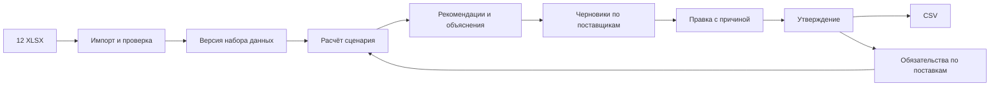
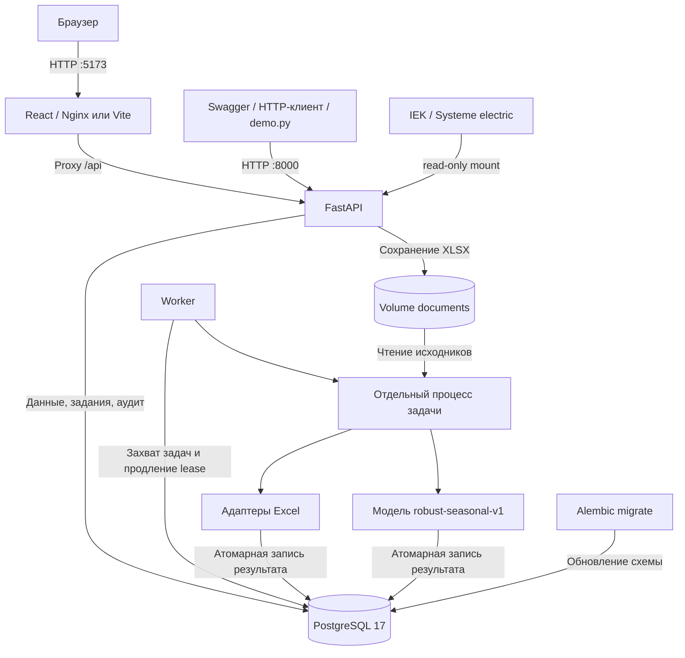

<div align="center">

# OptiStock

### Планирование закупок с объяснимыми рекомендациями

От Excel-выгрузок до согласованного заказа поставщику.


**Кейс «Электрокомплект» · HackAlem AI · IEK / Systeme Electric**

[О проекте](#overview) · [Архитектура](#architecture) · [Установка](#setup) · [API](#api) · [Демо](#demo)

</div>

---

> **Текущая версия — fullstack MVP.** Основной экран — **Procurement agent** (`/agent`): импорт, проверка данных, расчёт и подготовка черновиков. React-интерфейс доступен на English / Русский / Қазақша. Утверждение выполняет менеджер; поставщикам заказы не отправляются. Расчёт детерминированный и работает без внешних AI-ключей. Поверх него — необязательный **AI-ассистент** на OpenAI: он объясняет уже посчитанные числа и вызывает серверные инструменты, но не рассчитывает и не утверждает заказы.

<details>
<summary><strong>Навигация по README</strong></summary>

- [О проекте](#overview)
- [Исходные данные](#data)
- [Архитектура](#architecture)
- [Структура репозитория](#structure)
- [Интерфейс и быстрый запуск для жюри](#frontend)
- [Setup & Installation](#setup)
- [Конфигурация](#configuration)
- [Алгоритм и сценарии](#planning)
- [API endpoints](#api)
- [Примеры запросов](#examples)
- [Демонстрация](#demo)
- [Тестирование](#testing)
- [Эксплуатация и устранение проблем](#operations)
- [Ограничения и развитие](#limitations)
- [Документация](#documentation)

</details>

<a id="overview"></a>
## О проекте

OptiStock помогает закупщику определить, какие товары и в каком количестве заказать. Система объединяет продажи, остатки, товары в пути, сезонность и ограничения закупки, рассчитывает потребность по датам и сохраняет объяснение каждого решения.

Менеджер проверяет исходные данные, изменяет количество с указанием причины, передаёт заказ на утверждение и выгружает согласованную ревизию в CSV. Утверждённые заказы учитываются в следующих расчётах как ожидаемые поступления.

| Возможность | Реализация |
| --- | --- |
| Агент закупок | Единый запуск проверки, очистки, расчёта, анализа рисков и подготовки черновиков |
| Интерфейс | React 19, три языка, графики, история запусков и согласование заказов |
| Импорт | Комплект из 12 XLSX и загрузка через API; адаптеры IEK и Systeme Electric |
| Каталог | Поиск по коду и названию, фильтры поставщика и категории, история и исходные операции |
| Планирование | Сезонность, тренд, сценарный рост, обработка выбросов и оценка потерянного спроса |
| Объяснения | Дневная проекция, запас, поступления, поправки, округление и происхождение данных |
| Заказы | Черновики по поставщикам, правки с причиной, ревизии, утверждение и отмена |
| Экспорт | CSV с количествами в складских и закупочных единицах |
| Доступ | Персональные API-ключи, четыре серверные роли, отзыв ключей |
| Надёжность | Очередь в PostgreSQL, повторные попытки, идемпотентность, проверка актуальности плана |
| Аудит | История импорта, расчётов и действий с заказами, включая экспорт |

### Технологический стек

| Слой | Технологии |
| --- | --- |
| Язык | Python ≥ 3.12; Docker использует Python 3.13 |
| Frontend | React 19, TypeScript strict, Vite, React Router, Recharts, Lucide |
| HTTP API | FastAPI, Uvicorn, Pydantic / pydantic-settings |
| Хранение | PostgreSQL 17, SQLAlchemy 2, psycopg 3, JSONB |
| Миграции | Alembic |
| Excel | openpyxl, defusedxml |
| Фоновые задачи | Собственный worker и таблица `jobs` в PostgreSQL |
| Проверки | pytest, httpx, Ruff, GitHub Actions |
| Развёртывание | Docker Compose и постоянные volumes |

Версии зависимостей закреплены в [requirements.lock](requirements.lock). Redis, Celery и отдельный брокер сообщений для текущего MVP не требуются.

<a id="data"></a>
## Исходные данные

Работаем с файлами задания, а не подтверждёнными текущими данными компании. Отдельный синтетический Demo workspace обозначен в интерфейсе.

В репозитории находятся [IEK/](IEK/) и [Systeme electric/](Systeme%20electric/) — по шесть тестовых XLSX. Дата среза по умолчанию — **22 сентября 2026 года**. Дополнительные выгрузки для демонстрации не нужны.

| Источник | Использование |
| --- | --- |
| Месячные продажи | Основной временной ряд спроса |
| Динамика продаж / документы | Детализация операций и проверка аномальных крупных покупок |
| Месячные остатки | История запасов и сценарная оценка stockout |
| MOQ | Минимальный заказ и доступные ограничения кратности |
| Товары в пути | Поступления с датами; для Systeme также свободный остаток и категория |
| Сезонность | Нормированный месячный профиль поставщика по завершённым годам |

Импорт привязан к формату этих выгрузок. Произвольный XLSX с другими колонками не является поддерживаемым источником. Адаптер выбирает лист `TDSheet`, если он есть, иначе первый лист; тип определяет по заголовкам и, для месячных таблиц, имени файла. Формулы Excel не исполняются: читаются сохранённые значения.



Повторный импорт одинакового комплекта с той же датой среза переиспользует набор. Каждый новый расчёт сохраняет отдельный план с параметрами и версией алгоритма. Исходные файлы хранятся по SHA-256. Происхождение данных включает файл, лист, строку и, где предусмотрено, колонку.

<a id="architecture"></a>
## Архитектура



### Сервисы Docker Compose

| Сервис | Назначение | Доступ с хоста |
| --- | --- | --- |
| `frontend` | React SPA через Nginx; проксирует `/api/` к API | `127.0.0.1:5173` |
| `db` | PostgreSQL; при первой инициализации создаёт `optistock`, `optistock_test` и роль приложения | `127.0.0.1:5435` |
| `migrate` | Однократно выполняет `alembic upgrade head` после готовности БД | Нет |
| `api` | Авторизация, HTTP API, постановка заданий, операции с заказами | `127.0.0.1:8000` |
| `worker` | Выполняет импорт и расчёт после успешных миграций | Нет |

API и worker используют один образ, одну БД и общее файловое хранилище. Excel не включён в образ: API получает исходный комплект через read-only mounts и копирует его в `documents`. PostgreSQL сохраняет данные в volume `database`.

### Выполнение задач

Импорт и расчёт асинхронны: API возвращает `202 Accepted` и `job_id`, клиент опрашивает `GET /api/v1/jobs/{id}`.

- Статусы задачи: `queued → running → succeeded` либо `failed`. Для набора и плана успешный статус называется `ready`.
- Worker захватывает задачу через `FOR UPDATE SKIP LOCKED` и получает ограниченное по времени право её обработки — lease.
- По умолчанию lease действует 60 секунд и продлевается; лимит задачи — 900 секунд, число попыток — 3.
- Каждая задача запускается в отдельном процессе. Перед публикацией проверяются token и срок lease: старый процесс не может перезаписать результат после перехвата задачи.
- Результат и статус успеха записываются одной транзакцией. Частично импортированный набор не становится готовым.
- Временные ошибки повторяются в пределах лимита; ошибки данных завершают задачу. Для `failed` доступен ручной retry через API.

### Модель хранения

| Таблица | Содержимое и связи |
| --- | --- |
| `credentials` | Имя, роль, SHA-256 ключа, активность |
| `datasets` | Дата среза, сигнатура комплекта, статус и сводка |
| `source_files` | Файлы набора: поставщик, имя, SHA-256, тип |
| `items` | Снимок SKU; уникальная комбинация `dataset_id + supplier + code`; история и источники в JSONB |
| `plans` | Набор, сценарий, версия алгоритма, сводка и версии обязательств поставщикам |
| `recommendations` | Количество, риск, дата поставки и объяснение по товару |
| `agent_runs` | Запуск агента, связь с планом и сохранённый отчёт |
| `jobs` | Очередь, прогресс, попытки, lease, token и ошибка |
| `purchase_orders` | Заказ по паре план/поставщик, статус, ревизия, авторы, дата поставки |
| `order_lines` | Рекомендованное и выбранное количество, причина правки |
| `supplier_states` | Ревизия обязательств поставщику для проверки актуальности плана |
| `idempotency` | Результаты изменяющих запросов и хеши их тела |
| `audit_events` | Автор, действие, объект, время, детали |

MOQ, количества и остатки в БД используют `Numeric(20, 4)`. История, сценарии и объяснения хранятся в JSONB. Права, ревизии и транзакционные блокировки проверяются сервером.

<a id="structure"></a>
## Структура репозитория

```text
.
├── backend/optistock/
│   ├── api.py                 # HTTP endpoints, авторизация, ошибки, CSV
│   ├── schemas.py             # Входные схемы и параметры сценария
│   ├── services.py            # Импорт, планы, заказы, идемпотентность, аудит
│   ├── ingestion.py           # Проверка XLSX и адаптеры поставщиков
│   ├── agent.py               # Проверки, этапы и отчёт агента
│   ├── assistant.py           # Цикл function calling OpenAI и сохранение ответов
│   ├── tools.py               # Серверный реестр инструментов AI с валидацией аргументов
│   ├── backtest.py            # Историческая оценка прогноза
│   ├── planning.py            # Детерминированная модель расчёта
│   ├── worker.py              # Очередь, lease, повторы, процессы задач
│   ├── models.py              # SQLAlchemy-модели PostgreSQL
│   ├── db.py                  # Подключение и сессии БД
│   ├── config.py              # Настройки из окружения и .env
│   ├── middleware.py          # Ограничение размера HTTP-запроса
│   ├── errors.py              # Доменные ошибки
│   ├── cli.py                 # Создание и отзыв API-ключей
│   └── __init__.py            # Версия пакета
├── frontend/                  # React, TypeScript, Vite, Nginx и Playwright
├── migrations/                # Alembic и миграция схемы
├── scripts/
│   ├── configure.py           # Генерация .env со случайными паролями
│   ├── demo.py                # Сквозной сценарий через HTTP API
│   ├── local_dev.py           # Полный локальный стек Windows без Docker
│   ├── jury_demo.py           # Демонстрация для жюри
│   ├── backtest.py            # Запуск исторической проверки
│   └── test.py                # Миграции, pytest и проверка схемы
├── tests/                     # Расчёт, импорт, API, ограничения, конкуренция
├── docker/
│   ├── Dockerfile.db          # Образ PostgreSQL
│   └── init-db.sh             # Создание роли и двух БД
├── IEK/                       # 6 исходных XLSX
├── Systeme electric/          # 6 исходных XLSX
├── .github/workflows/frontend.yml # Проверки frontend в CI
├── .env.example               # Пример конфигурации без реальных секретов
├── Dockerfile                 # Образ API и worker
├── compose.yaml               # Сервисы, volumes, healthchecks, лимиты
├── alembic.ini                # Настройки миграций
├── pyproject.toml             # Пакет, CLI, pytest и Ruff
├── requirements.lock          # Зафиксированные зависимости
├── README.md                  # Основная документация
└── *.md                       # Кейс, архитектурные материалы и проверки
```

Локально появляются `.env`, `.venv/` и `var/` — ключи, файлы, выгрузки и отчёты. Эти рабочие файлы исключены из Git.

<a id="frontend"></a>
## Интерфейс и быстрый запуск для жюри

### Для жюри: проверка за несколько минут

1. Запустить проект по одной из инструкций ниже. Открыть **Procurement agent**.
2. При первом запуске нажать **Загрузить материалы кейса**; для своих файлов использовать **Импорт Excel** с форматом IEK/Systeme. Дождаться завершения импорта.
3. Выбрать набор данных, поставщика/категорию, срок поставки, цикл, страховой запас и рост. Нажать **Запустить агента**.
4. Проверить этапы, показатели, вкладки **Требуют внимания** и **Разовые всплески**. Нажатие на SKU открывает числовое объяснение и источники.
5. Нажать **Проверить заказ**, изменить количество с причиной, сохранить и нажать **Approve order**, затем **Export CSV**. Закрыть и снова открыть страницу: расчёты и заказы сохранены в PostgreSQL.

Проверенный исходный сценарий: 491 позиция к пополнению (IEK 335, Systeme 156), 162 риска дефицита, 241 поправка по товарам в 231 уникальном документе у 190 SKU. Импорт и работа агента — 25,5 с в одном локальном замере. Полный браузерный тест с правкой, утверждением и экспортом также выполнен. Доказательства и ограничения: [VERIFICATION.md](VERIFICATION.md), [CASE_EVIDENCE.md](CASE_EVIDENCE.md). [Трёхминутная демонстрация и текст для сдачи](JURY_GUIDE.md).

### Быстрый запуск на Windows без Docker

Требуются Python 3.12+, Node.js 24 и установленные бинарники PostgreSQL в `C:\Program Files\PostgreSQL\…\bin`. Проверено с Python 3.13 и PostgreSQL 18.6.

```powershell
python -m venv .venv
.\.venv\Scripts\python.exe -m pip install -r requirements.lock
.\.venv\Scripts\python.exe -m pip install --no-deps -e .
Push-Location frontend
npm.cmd ci
Pop-Location
.\.venv\Scripts\python.exe scripts/local_dev.py
```

Открыть **http://127.0.0.1:5173/agent**. Скрипт создаёт отдельный кластер в `var/local/postgres`, базы `optistock` и `optistock_test`, применяет миграции и запускает API, worker, frontend. Системная PostgreSQL-служба и существующие базы не изменяются. Порты: 5435 / 8000 / 5173. Логи и PID — `var/local/`; повторный запуск сохраняет данные.

Локальный ключ хранится на сервере в `var/local/api-key`; браузер обращается через dev proxy без получения ключа. Этот режим включается только локальным `.env.local`, проверяет origin/host и не включается в production-сборку. Если ранее выбран Demo workspace, на странице агента нажать **Подключить локальный сервер**. Для Docker и внешних API используются персональные ключи через Settings.

### Технологии и архитектура

React 19, TypeScript strict, Vite, Recharts; Python/FastAPI, Pydantic, openpyxl; PostgreSQL, SQLAlchemy и Alembic. Очередь задач находится в PostgreSQL, отдельный worker выполняет импорт и расчёт. API выдаёт результаты React-интерфейсу. Исходные файлы хранятся по SHA-256; каждый план фиксирует параметры, объяснения и версии обязательств.

Агент — исполняемый workflow из проверяемых инструментов: проверка → очистка → расчёт → риски → черновики. LLM не генерирует закупочные количества. Результат, журнал агента и черновики публикуются одной транзакцией; повторы защищены идемпотентностью и lease/token. Утверждение — отдельная операция менеджера с проверкой роли и ревизии.

Проект разработан с AI-агентом **Codex**, включая реализацию и автоматические проверки. Для планирования, импорта и заказов внешние платные API, ключи и GPU не нужны — весь расчёт выполняется локально. Серверный ключ OpenAI требуется только разделу «AI-ассистент»; без него остальные функции работают в полном объёме. Публичная deployed-версия пока отсутствует; адрес выше — локальный. Репозиторий команды: [BAITC-Hacks/hack-32f862cb-aim](https://github.com/BAITC-Hacks/hack-32f862cb-aim).

### React-интерфейс

Переключение **English / Русский / Қазақша** доступно в верхней панели и настройках. Выбор сохраняется в браузере; переведены все страницы, формы, статусы, графики и объяснения агента. Данные товаров и исходные документы сохраняют оригинальные названия. Подробнее: [frontend/README.md](frontend/README.md#язык-интерфейса).

```powershell
cd frontend
npm.cmd ci
npm.cmd run dev
```

Открыть **http://localhost:5173**. Нужен Node.js 24; в Linux/macOS используйте `npm` вместо `npm.cmd`. По умолчанию доступен интерактивный деморежим. Для работы с бэкендом: **Settings → API address `/api/v1` → API access key → Connect workspace**.

Реализованы Dashboard, Inventory, Suppliers, Orders, Forecast, Analytics, Reports и Settings. Полная инструкция, особенности данных и проверки: [frontend/README.md](frontend/README.md).

Не запускайте Vite, локальный стек и Docker frontend одновременно на порту 5173. Для Docker API подключение задаётся в Settings; локальный скрипт на Windows настраивает dev proxy. Синтетический Demo workspace позволяет изучить интерфейс без сервера, но запуск агента требует работающего API и worker.

<a id="setup"></a>
## Setup & Installation

Все команды выполняются из корня репозитория. Для запуска в Docker нужны Git, Docker с Compose v2 и Python 3 для генератора `.env`. Для локальной разработки и demo нужен **Python 3.12+**; версия 3.13 совпадает с Docker.

### 1. Получить проект

```bash
git clone https://github.com/BAITC-Hacks/hack-32f862cb-aim.git
cd hack-32f862cb-aim
```

Если репозиторий уже открыт локально, используйте его текущую папку.

### 2. Запустить сервисы

```bash
python scripts/configure.py
docker compose up -d --build
docker compose ps -a
```

Frontend будет доступен на **http://localhost:5173/agent**. Node.js на хосте для Docker-запуска не требуется.

На Linux/macOS при необходимости используйте `python3` вместо `python`. Генератор создаёт случайные пароли и сохраняет существующий `.env` без изменений. `.env.example` содержит заглушки; для первого запуска предпочтителен генератор.

`db` должен стать healthy, `migrate` — завершиться с кодом `0`, `api` — стать healthy, `worker` — остаться запущенным. Завершившийся `migrate` — нормальное состояние.

| Адрес | Назначение |
| --- | --- |
| <http://localhost:5173/agent> | Procurement agent: основной рабочий экран |
| <http://localhost:8000/docs> | Swagger UI: схемы и интерактивные запросы |
| <http://localhost:8000/redoc> | ReDoc: справочник API |
| <http://localhost:8000/openapi.json> | OpenAPI-схема |
| <http://localhost:8000/health/live> | Процесс API отвечает |
| <http://localhost:8000/health/ready> | Доступна БД и читается таблица Alembic |

Readiness не проверяет worker и не сравнивает ревизию БД с последней миграцией. Корневой маршрут `/` не определён; для начала откройте `/docs`.

### 3. Создать API-ключ

Ключ показывается только при создании; в БД хранится его SHA-256. Для полного локального демо нужна роль `admin`.

<details open>
<summary><strong>Windows · PowerShell</strong></summary>

```powershell
New-Item -ItemType Directory -Force var | Out-Null
docker compose exec -T api optistock create-key --name demo-admin --role admin | Set-Content -Encoding ascii var/admin.key
```

ASCII сохраняет ключ без BOM и подходит для чтения `scripts/demo.py`.

</details>

<details>
<summary><strong>Linux / macOS · Bash</strong></summary>

```bash
mkdir -p var
(umask 077; docker compose exec -T api optistock create-key --name demo-admin --role admin > var/admin.key)
```

</details>

В Swagger нажмите **Authorize** и вставьте содержимое `var/admin.key` без префикса `Bearer`. Проверить роль можно через `GET /api/v1/me`.

Для других пользователей создавайте отдельные ключи:

```bash
docker compose exec api optistock create-key --name buyer --role planner
docker compose exec api optistock create-key --name manager --role approver
docker compose exec api optistock create-key --name observer --role viewer
```

Отзыв: `docker compose exec api optistock revoke-key --name buyer`. Имя уже созданного ключа нельзя использовать повторно, включая отозванные ключи. При повторной установке сохраняйте существующий `var/admin.key`; для нового ключа выбирайте новое имя и файл.

### 4. Установить окружение для demo и разработки

<details open>
<summary><strong>Windows · PowerShell</strong></summary>

```powershell
python -m venv .venv
.\.venv\Scripts\python.exe -m pip install -r requirements.lock
.\.venv\Scripts\python.exe -m pip install --no-deps -e .
```

</details>

<details>
<summary><strong>Linux / macOS · Bash</strong></summary>

```bash
python3 -m venv .venv
.venv/bin/python -m pip install -r requirements.lock
.venv/bin/python -m pip install --no-deps -e .
```

</details>

Активация venv не обязательна: команды ниже используют исполняемые файлы окружения напрямую.

### Локальная разработка: API и worker вне Docker

Можно оставить в Docker только PostgreSQL. Остановите контейнерные API и worker, если ранее запускали полный стек:

```bash
docker compose stop api worker frontend
docker compose up -d db
```

После готовности БД выполните миграции, затем запустите API и worker в разных терминалах:

| Действие | Windows PowerShell | Linux / macOS |
| --- | --- | --- |
| Миграции | `.\.venv\Scripts\alembic.exe upgrade head` | `.venv/bin/alembic upgrade head` |
| API, терминал 1 | `.\.venv\Scripts\uvicorn.exe optistock.api:app --reload` | `.venv/bin/uvicorn optistock.api:app --reload` |
| Worker, терминал 2 | `.\.venv\Scripts\python.exe -m optistock.worker` | `.venv/bin/python -m optistock.worker` |
| Ключ при необходимости | `.\.venv\Scripts\optistock.exe create-key --name local-admin --role admin` | `.venv/bin/optistock create-key --name local-admin --role admin` |

Запускайте процессы из корня проекта: они должны читать один `.env` и одно хранилище `var/files`. Ключи остаются действительными при использовании той же БД.

Локальный и контейнерный worker не должны одновременно обрабатывать очередь с разными файловыми хранилищами. Если набор ранее импортировали в Docker, его файлы находятся в volume `documents`. Для локальной обработки нужен доступ к тем же исходникам; sample-комплект можно повторно импортировать через локальный API, чтобы скопировать файлы в локальное хранилище.

<a id="configuration"></a>
## Конфигурация

Настройки читаются из переменных окружения и `.env` с префиксом `OPTISTOCK_`. Переменные окружения имеют приоритет. Пароли и API-ключи не добавляйте в Git.

| Переменная | Значение по умолчанию / назначение |
| --- | --- |
| `POSTGRES_PASSWORD` | Пароль администратора PostgreSQL для Compose; генерируется скриптом |
| `OPTISTOCK_DB_PASSWORD` | Пароль роли `optistock` для инициализации и подключения контейнеров |
| `OPTISTOCK_DATABASE_URL` | URL `postgresql+psycopg://…`; генератор задаёт `localhost:5435/optistock`, Compose — `db:5432/optistock` |
| `OPTISTOCK_TEST_DATABASE_URL` | URL отдельной БД с суффиксом `_test` для тестового скрипта |
| `OPTISTOCK_STORAGE_ROOT` | `var/files` локально; `/app/var/files` в контейнере |
| `OPTISTOCK_SAMPLE_ROOT` | `.` локально; `/samples` в контейнере |
| `OPTISTOCK_CORS_ORIGINS` | JSON-массив, по умолчанию `["http://localhost:5173"]` |
| `OPTISTOCK_UPLOAD_MAX_BYTES` | `26214400`: 25 МиБ на файл |
| `OPTISTOCK_XLSX_MAX_UNCOMPRESSED_BYTES` | `262144000`: 250 МиБ распакованного XLSX |
| `OPTISTOCK_XLSX_MAX_ROWS` | `400000`: лимит строк |
| `OPTISTOCK_LEASE_SECONDS` | `60`, минимум `10` |
| `OPTISTOCK_JOB_TIMEOUT_SECONDS` | `900`, минимум `30` |
| `OPTISTOCK_MAX_ATTEMPTS` | `3`, диапазон `1–10` |
| `OPTISTOCK_OPENAI_API_KEY` | Серверный ключ OpenAI. Пусто — раздел AI отключён, остальное работает |
| `OPTISTOCK_OPENAI_MODEL` | `gpt-5.4-mini-2026-03-17` |
| `OPTISTOCK_AI_TIMEOUT_SECONDS` | `45`, диапазон `5–120`: таймаут одного обращения к провайдеру |
| `OPTISTOCK_AI_REQUESTS_PER_HOUR` | `30`, диапазон `1–300`: лимит вопросов на пользователя |
| `OPTISTOCK_AI_MAX_STEPS` | `6`, диапазон `1–12`: ходов модели в одном цикле инструментов |
| `OPTISTOCK_AI_MAX_TOOL_CALLS` | `12`, диапазон `1–40`: вызовов инструментов за запрос |
| `OPTISTOCK_AI_TOTAL_SECONDS` | `180`, диапазон `10–600`: общее время одного AI-запроса |
| `OPTISTOCK_AI_TOKEN_BUDGET` | `120000`: суммарный лимит токенов запроса |

Compose явно передаёт URL БД, пути, CORS и настройки worker. Чтобы изменить лимиты XLSX в контейнерах, добавьте соответствующие переменные в общий блок `x-app.environment` в `compose.yaml`: одна запись в `.env` не передаёт их автоматически.

Дополнительные ограничения: HTTP-запрос до **50 МиБ**, от **1 до 12 файлов** на upload, уникальные имена XLSX до **250 символов**, до **2000 записей ZIP-архива**, до **256 колонок** и **20 млн ячеек** таблицы. XLSX с VBA-макросами отклоняется.

<a id="planning"></a>
## Алгоритм и сценарии

Версия модели — `robust-seasonal-v1`. Для каждой рекомендации сохраняются допущения и числовое разложение результата.

1. Используются завершённые месяцы продаж до даты среза; неполный текущий месяц исключается. Базовый дневной спрос рассчитывается по последним доступным месяцам, максимум по 12.
2. Крупные документы корректируются только при согласовании транзакций с месячным итогом. При восьми и более документах порог берётся по log-MAD распределения документов; на более коротких историях применяется консервативный резервный порог по медиане месячных продаж, а истории короче четырёх результативных месяцев помечаются `insufficient_history_for_outlier_detection` вместо догадки. Повторяющийся крупный спрос консервативно сохраняется. Транзакции не прибавляются к месячным продажам.
3. При включённой оценке stockout спрос корректируется по нулевым месячным снимкам запасов. Это приближение с сохранённым предупреждением.
4. Применяется сезонный профиль; тренд используется при согласии сравнений за 3 и 6 месяцев с прошлым годом. Сценарный рост задаётся отдельно.
5. Строится дневная проекция спроса, запаса и поступлений, включая утверждённые заказы. Поздняя поставка не закрывает предшествующий дефицит.
6. Рассчитывается потребность с даты новой поставки до конца горизонта и страховой остаток. Заказ округляется по MOQ, кратности и закупочным единицам.

```text
Горизонт = lead_time_days + review_days
Дата новой поставки = as_of + lead_time_days
Страховой запас = прогноз спроса на safety_days после горизонта

Потребность = max(0,
                 максимальный дефицит с даты новой поставки,
                 страховой запас − остаток на конец горизонта)

При положительной потребности:
Закупочные единицы = ceil(max(потребность / conversion, MOQ) / multiple) × multiple
Складские единицы = закупочные единицы × conversion
```

Потерянные продажи до прихода новой поставки учитываются отдельно и не превращаются в отложенный заказ. Без месячной истории количество заказа равно нулю, статус — `insufficient_data`.

### Поля `scenario`

| Поле | По умолчанию | Допустимые значения / смысл |
| --- | --- | --- |
| `supplier` | `null` | Все поставщики либо `iek` / `systeme` |
| `category` | `null` | Исходный код категории, до 80 символов |
| `lead_time_days` | `30` | Срок поставки, `1–180` дней |
| `review_days` | `30` | Период пересмотра, `1–90` дней |
| `safety_days` | `14` | Страховое покрытие, `0–90` дней |
| `category_safety_days` | `{}` | До 50 кодов категорий со значениями `0–90`; пример: `{"1":21,"7":7}` |
| `growth_percent` | `0` | Сценарный прирост от `−50` до `200` % |
| `remove_outliers` | `true` | Коррекция аномальных крупных документов |
| `estimate_stockouts` | `true` | Оценка потерянного спроса по остаткам |
| `use_seasonality` | `true` | Применение сезонного профиля |
| `use_trend` | `true` | Применение согласованного тренда |
| `blank_monthly_sales_as_zero` | `true` | Пустые месячные значения считать нулём; при `false` исключать |
| `missing_inventory` | `latest_snapshot` | Последний доступный снимок; альтернатива — `zero` |
| `default_minimum` | `"1"` | MOQ при отсутствии данных, `0 < x ≤ 1000000` |
| `default_multiple` | `"1"` | Кратность при отсутствии данных, `0 < x ≤ 1000000` |
| `cable_reel_meters` | `"305"` | Длина бухты для отмеченных кабелей, `0 < x ≤ 10000` |

Для трёх десятичных параметров разрешено до четырёх знаков после запятой. Неизвестные поля JSON-запросов отклоняются. Коды категорий используются как в источнике: система не объявляет их ABC-классами без расшифровки.

### Статусы рекомендаций

| `risk` | Значение |
| --- | --- |
| `critical` | Ожидается потеря продаж до даты новой поставки |
| `reorder` | Требуется закупка, дефицита до поставки модель не обнаружила |
| `covered` | По сценарию дополнительная закупка не требуется |
| `insufficient_data` | Нет месячной истории для расчёта |

В подробном `explanation` доступны сценарий, источник запаса, базовый спрос, сезонность, тренд, прогноз, страховой запас, исходная потребность и округлённый заказ. Поля `raw_monthly_sales`, `outlier_exclusions`, `stockout_adjustments`, `cleaned_monthly_sales`, `daily_projection`, `commitments`, `warnings` и `sources` позволяют проверить поправки, дневной баланс, учтённые заказы и происхождение данных. `rounding` содержит `minimum`, `multiple`, `conversion`; `text` — краткое объяснение.

<a id="api"></a>
## API endpoints

Базовый URL: `http://localhost:8000`. Интерактивный контракт: [/docs](http://localhost:8000/docs), машиночитаемый — [/openapi.json](http://localhost:8000/openapi.json).

### Авторизация и роли

Все `/api/v1/*` требуют `Authorization: Bearer <API_KEY>`. Health и страницы документации доступны без ключа.

| Операции | `viewer` | `planner` | `approver` | `admin` |
| --- | :---: | :---: | :---: | :---: |
| Чтение, аудит, экспорт утверждённого заказа | ✓ | ✓ | ✓ | ✓ |
| Импорт, retry задачи, создание плана | — | ✓ | — | ✓ |
| Создание и правка черновиков | — | ✓ | — | ✓ |
| Утверждение и отмена | — | — | ✓ | ✓ |

`approver` не наследует права `planner`. Управление ключами выполняется через CLI при доступе к среде приложения, отдельного HTTP endpoint для этого нет.

### Общие правила

- Каждый `POST` и `PATCH` требует `Idempotency-Key` длиной 1–128 символов. Ключ связан с пользователем и операцией: повтор того же запроса возвращает сохранённый результат, другое тело с тем же ключом даёт `409`. Для нового действия нужен новый ключ.
- Идентификаторы — UUID, даты — `YYYY-MM-DD`. Количества рекомендуется передавать десятичными строками, например `"120.0000"`.
- Основная пагинация: `limit=50` (`1–200`), `offset=0` (`≥0`). Для транзакций: `limit=100` (`1–500`).
- Списки наборов, планов, заказов и аудита возвращают `{"items":[...]}`. Каталог, транзакции и рекомендации дополнительно содержат `total`.
- Обычный успешный ответ — `200`; асинхронная операция — `202`, создание черновиков — `201`.

В таблицах **Чтение** — любая действующая роль; **Планирование** — `planner` или `admin`; **Согласование** — `approver` или `admin`. `{id}` — UUID ресурса; в OpenAPI параметр называется `identifier`.

### Health и доступ

| Метод | Endpoint | Доступ | Результат |
| --- | --- | --- | --- |
| GET | `/health/live` | Публичный | `status`, `service`, `version` |
| GET | `/health/ready` | Публичный | Проверка БД и наличия таблицы Alembic |
| GET | `/api/v1/me` | Чтение | `id`, `name`, `role` текущего ключа |

### Импорт и задачи

| Метод | Endpoint | Доступ | Параметры / результат |
| --- | --- | --- | --- |
| POST | `/api/v1/datasets/sample` | Планирование | JSON `{"as_of":"2026-09-22"}` или `{}`; `202`, `dataset_id`, `job_id`, `reused` |
| POST | `/api/v1/datasets/upload` | Планирование | Multipart: `supplier`, `as_of`, повторяемое поле `files`; `202`, идентификаторы набора и задачи |
| GET | `/api/v1/datasets` | Чтение | Наборы, `limit`, `offset` |
| GET | `/api/v1/datasets/{id}` | Чтение | Статус, сводка и состав файлов |
| GET | `/api/v1/jobs/{id}` | Чтение | Статус, `progress`, `attempts`, `error`, даты; внутренний token исключён |
| POST | `/api/v1/jobs/{id}/retry` | Планирование | Только для `failed`, тело не требуется; `202`, сброс попыток и постановка в очередь |

Upload принимает файлы **одного поставщика** (`iek` или `systeme`) за запрос и создаёт самостоятельный набор. Для совместного расчёта обоих поставщиков на комплекте репозитория используйте sample-импорт.

### Каталог

| Метод | Endpoint | Доступ | Параметры / результат |
| --- | --- | --- | --- |
| GET | `/api/v1/items` | Чтение | Обязательный `dataset_id`; `supplier`, `category`, `q` (до 100 символов), `limit`, `offset` |
| GET | `/api/v1/items/{id}` | Чтение | Карточка, история, источники, число операций `transaction_rows` |
| GET | `/api/v1/items/{id}/transactions` | Чтение | Исходные операции, `limit`, `offset` |

### Планы и рекомендации

| Метод | Endpoint | Доступ | Параметры / результат |
| --- | --- | --- | --- |
| POST | `/api/v1/plans` | Планирование | `dataset_id`, необязательный `scenario`; `202`, `plan_id`, `job_id` |
| GET | `/api/v1/plans` | Чтение | Список планов, `limit`, `offset` |
| GET | `/api/v1/plans/{id}` | Чтение | Статус, параметры, версия алгоритма, сводка |
| GET | `/api/v1/plans/{id}/recommendations` | Чтение | `supplier`, `risk`, `limit`, `offset`; количества, предупреждения, краткие причины |
| GET | `/api/v1/recommendations/{id}` | Чтение | Рекомендация с полным `explanation` |

### Агент закупок

| Метод | Endpoint | Доступ | Параметры / результат |
| --- | --- | --- | --- |
| POST | `/api/v1/agent/runs` | Планирование | `dataset_id`, `scenario`; `202`, `run_id`, `plan_id`, `job_id` |
| GET | `/api/v1/agent/runs` | Чтение | Необязательный `dataset_id`, `limit=20` (`1–100`), без offset; `items` |
| GET | `/api/v1/agent/runs/{id}` | Чтение | Сохранённый отчёт, статус, сценарий, задача и ссылки на заказы |

Агент выполняет workflow «проверка → очистка → расчёт → риски → черновики». План, отчёт и черновики публикуются одной транзакцией; утверждение остаётся отдельным действием менеджера. LLM не генерирует закупочные количества.

### AI-ассистент

Необязательный раздел. Включается только серверным ключом OpenAI; при пустом ключе `POST` возвращает `503 ai_not_configured`, а планирование продолжает работать.

| Метод | Endpoint | Доступ | Параметры / результат |
| --- | --- | --- | --- |
| GET | `/api/v1/assistant/status` | Чтение | Настроен ли ключ, модель, лимиты и список доступных инструментов |
| POST | `/api/v1/assistant/runs` | Планирование / согласование | `plan_id`, `task` (`risks`/`explain`/`what_if`), `question`, `item_id`, `scenario`; `202`, `run_id`, `job_id` |
| GET | `/api/v1/assistant/runs` | Чтение | `plan_id`, `limit=20`; только собственные запросы автора |
| GET | `/api/v1/assistant/runs/{id}` | Чтение | Ответ модели, вызванные инструменты, проверяемые числа и usage |

Запрос выполняется фоновым worker'ом как задача `kind=assistant` с тем же lease/token, что импорт и расчёт. Результат сохраняется в `assistant_runs` и переживает перезагрузку страницы. Повтор через `POST /api/v1/jobs/{id}/retry` запрещён: новый вопрос — новый запрос к модели и новая оплата.

**Function calling.** Модель ведёт ограниченный цикл Responses над фиксированным серверным реестром инструментов:

| Инструмент | Что возвращает |
| --- | --- |
| `get_plan_summary` | Сценарий плана, счётчики риска, суммы заказа по поставщику и единице, черновики |
| `find_items` | Поиск SKU внутри этого плана по коду/наименованию, фильтры риска и поставщика |
| `explain_item` | Числовое разложение рекомендации: прогноз, страховой запас, запас, поступления, округление |
| `sales_history` | Исходный и очищенный месячные ряды, сезонный профиль и тренд |
| `compare_scenario` | Пересчёт тех же SKU расчётным ядром с другими параметрами и сравнение before/after |

Границы, которые обеспечивает сервер, а не инструкция модели:

- Модель не получает SQL, Python, URL или команды. Она выбирает только имя инструмента и аргументы, которые повторно валидируются против плана этого запроса.
- Количества считает детерминированное ядро. `compare_scenario` вызывает ту же функцию `calculate`, что и обычный план; гипотетический расчёт не меняет сохранённый план, заказы и обязательства.
- Поставщик и категория сравнения неизменны: сравнение не может расширить охват SKU.
- Товар вне плана отклоняется. Номера документов и клиентские данные в провайдера не уходят.
- Бюджеты: ходы модели, вызовы инструментов, общее время и токены. Исчерпание бюджета даёт ответ по уже собранным данным, а не ошибку.
- У ассистента нет инструмента правки, утверждения или отправки заказа. Ответы видит только их автор.

Интерфейс показывает ответ модели, список вызванных инструментов и проверяемые числа сервера рядом с текстом. В деморежиме ответы не генерируются — панель просит подключить сервер.

### Заказы и аудит

| Метод | Endpoint | Доступ | Параметры / результат |
| --- | --- | --- | --- |
| POST | `/api/v1/orders` | Планирование | `{"plan_id":"<UUID>"}`; `201`, массив `order_ids` |
| GET | `/api/v1/orders` | Чтение | Список заказов, `limit`, `offset` |
| GET | `/api/v1/orders/{id}` | Чтение | Заказ, текущая `revision` и `lines` |
| PATCH | `/api/v1/orders/{id}` | Планирование | `revision`, `lines` из `line_id`, `quantity`, `reason`; новая ревизия |
| POST | `/api/v1/orders/{id}/approve` | Согласование | `{"revision":1}`; утверждение текущей ревизии |
| POST | `/api/v1/orders/{id}/cancel` | Согласование | `{"revision":1}`; отмена черновика или утверждённого заказа |
| GET | `/api/v1/orders/{id}/export` | Чтение | CSV только для `approved`; действие записывается в аудит |
| GET | `/api/v1/audit` | Чтение | Необязательный `entity_id`, `limit`, `offset` |

В коде `approve` и `cancel` обслуживаются одним маршрутом `POST /api/v1/orders/{identifier}/{action}`, где `action` ограничен этими двумя значениями.

### Ревизии и согласование

Заказ создаётся с `revision=1`. Правка, утверждение и отмена увеличивают ревизию. Перед изменением получите актуальный заказ: старая ревизия приводит к `409 revision_conflict`.

Править можно только `draft`. В правке допустимо 1–5000 строк, количество от `0` до `1000000000` с четырьмя десятичными знаками, причина — 3–1000 символов. Нулевое количество исключает позицию из экспорта; положительное должно соответствовать MOQ, кратности и закупочной единице.

Черновики создаются только по положительным рекомендациям. Если закупка не нужна, `order_ids` может быть пустым. Утвердить заказ без положительных количеств нельзя.

Утверждение создаёт обязательство по поставке. Если после расчёта изменились обязательства тому же поставщику, API вернёт `409 stale_plan`: нужен новый план. Отмена утверждённого заказа освобождает обязательство. Повторное создание заказов из прежнего плана возвращает существующие заказы, включая отменённые; для нового цикла закупки создайте новый план.

### CSV

Кодировка — **UTF-8 с BOM**, разделитель — `;`. Имя: `optistock-<order_id>-r<revision>.csv`.

```text
order_id;revision;supplier;code;name;stock_unit;stock_quantity;purchase_quantity;arrival_date
```

Экспортируются только положительные количества утверждённой ревизии. Потенциальные формулы в текстовых ячейках экранируются. Совместимость с конкретным импортом 1С не подтверждена.

### Ошибки

Типичная ошибка приложения:

```json
{
  "code": "revision_conflict",
  "message": "Ревизия заказа устарела",
  "details": [],
  "request_id": "<UUID>"
}
```

Ответы, прошедшие middleware контекста, содержат `X-Request-ID`: сохраняйте его при разборе ошибок. Ранний отказ по размеру запроса может иметь сокращённое тело.

| HTTP | Причина / действие |
| --- | --- |
| `401` | Ключ отсутствует, недействителен или отозван |
| `403` | Роль не разрешает операцию |
| `404` | Ресурс не найден |
| `409` | Конфликт ключа или ревизии, неготовый набор/план, устаревший план, неверное состояние |
| `413` | Превышен лимит запроса, файла или таблицы |
| `422` | Некорректные поля, количество или ограничения заказа |
| `500` | Внутренняя ошибка |
| `503` | Ошибка доступа к БД; повторите изменяющий запрос с тем же ключом идемпотентности |

Ошибка фоновой обработки хранится в `job.error`: успешная постановка задачи ещё не означает успешный импорт или расчёт.

<a id="examples"></a>
## Примеры запросов

В Swagger UI авторизуйтесь, выберите endpoint, нажмите **Try it out** и укажите уникальный `Idempotency-Key` для изменения данных.

### Импорт и ожидание результата · PowerShell

```powershell
$baseUrl = 'http://localhost:8000'
$apiKey = (Get-Content -Raw var/admin.key).Trim()
$readHeaders = @{ Authorization = "Bearer $apiKey" }
$writeHeaders = @{
    Authorization = "Bearer $apiKey"
    'Idempotency-Key' = [guid]::NewGuid().ToString()
}

$import = Invoke-RestMethod -Method Post -Uri "$baseUrl/api/v1/datasets/sample" -Headers $writeHeaders -ContentType 'application/json' -Body '{"as_of":"2026-09-22"}'
$import
Invoke-RestMethod -Uri "$baseUrl/api/v1/jobs/$($import.job_id)" -Headers $readHeaders
```

Повторяйте последний GET до `succeeded` или `failed`. При ошибке посмотрите `error` и логи worker. После успеха используйте `$import.dataset_id` для создания плана.

### Создание плана · JSON

`POST /api/v1/plans`, с авторизацией и новым `Idempotency-Key`:

```json
{
  "dataset_id": "<dataset_id из импорта>",
  "scenario": {
    "lead_time_days": 30,
    "review_days": 30,
    "safety_days": 14,
    "category_safety_days": {"1": 21, "7": 7},
    "growth_percent": 0,
    "remove_outliers": true,
    "estimate_stockouts": true,
    "use_seasonality": true,
    "use_trend": true
  }
}
```

Замените placeholder реальным UUID. Ответ содержит `plan_id` и `job_id`. Дождитесь `succeeded`, затем запросите `/api/v1/plans/{plan_id}/recommendations?risk=critical` или весь список без фильтра.

### Создание, правка и утверждение заказа · JSON

Создать черновики: `POST /api/v1/orders` с `{"plan_id":"<UUID>"}`. Выберите заказ из `order_ids` и получите его через `GET /api/v1/orders/{id}`.

Правка: `PATCH /api/v1/orders/{id}`:

```json
{
  "revision": 1,
  "lines": [
    {
      "line_id": "<UUID строки заказа>",
      "quantity": "120.0000",
      "reason": "Количество скорректировано после проверки потребности"
    }
  ]
}
```

Количество замените допустимым для выбранного товара. Передайте возвращённую ревизию в `POST /api/v1/orders/{id}/approve`, например `{"revision":2}`, затем скачайте `/api/v1/orders/{id}/export`. Каждый новый POST/PATCH получает отдельный ключ идемпотентности.

### Загрузка поддерживаемого XLSX · Bash / curl

```bash
API_KEY="$(tr -d '\r\n' < var/admin.key)"
curl --fail-with-body -X POST http://localhost:8000/api/v1/datasets/upload \
  -H "Authorization: Bearer $API_KEY" \
  -H "Idempotency-Key: $(python3 -c 'import uuid; print(uuid.uuid4())')" \
  -F 'supplier=iek' \
  -F 'as_of=2026-09-22' \
  -F 'files=@/path/to/sales.xlsx' \
  -F 'files=@/path/to/stocks.xlsx'
```

Замените пути реальными файлами поддерживаемой схемы. `Content-Type: multipart/form-data` с boundary выставит curl.

<a id="demo"></a>
## Демонстрация

После запуска Docker, создания `var/admin.key` и установки venv:

| Среда | Команда |
| --- | --- |
| Windows | `.\.venv\Scripts\python.exe scripts/demo.py` |
| Linux / macOS | `.venv/bin/python scripts/demo.py` |

Другой адрес и ключ задаются аргументами `--url http://127.0.0.1:8000 --key-file var/admin.key`.

Скрипт проверяет readiness, импортирует 12 файлов, ждёт worker, рассчитывает план, создаёт черновики, сохраняет проверочную правку с причиной, утверждает заказы и скачивает CSV. Всё выполняется через HTTP API. Поставщикам ничего не отправляется.

Результаты в `var/`:

- `demo-summary.json` — идентификаторы, сводки и время выполнения;
- `optistock-<supplier>-<order_id>.csv` — экспорт каждого созданного заказа.

Повторный запуск переиспользует импорт, но создаёт новый план с учётом уже утверждённых заказов. Число рекомендаций и новых заказов может измениться. Для освобождения обязательств используйте отмену соответствующих заказов через API.

### Зафиксированный результат проверки

В [VERIFICATION.md](VERIFICATION.md) описан отдельный локальный запуск от **23 сентября 2026 года** на Docker Desktop ARM64, Python 3.13 и PostgreSQL 17.11:

| Показатель | Результат того запуска |
| --- | ---: |
| Исходные XLSX | 12 |
| Уникальные пары поставщик / код | 3 909 |
| IEK / Systeme Electric | 3 185 / 724 |
| Операции с числовым количеством | 248 884 |
| Товары с месячной историей | 3 017 |
| Рекомендации к закупке | 491 |
| Товары с дефицитом до поставки | 162 |
| Товары с `insufficient_data` | 892 |
| Строки заказов IEK / Systeme Electric | 335 / 156 |
| Полный HTTP-сценарий, один замер | 25,3 с |

Это результаты конкретного тестового сценария, а не гарантии производительности или точности прогноза. Параметры: срез `2026-09-22`, поставка 30 дней, пересмотр 30 дней, страховое покрытие 14 дней.

<a id="testing"></a>
## Тестирование

Нужны установленный venv и запущенная PostgreSQL. `configure.py` задаёт `OPTISTOCK_TEST_DATABASE_URL`, а Docker при первой инициализации создаёт `optistock_test`.

> Тесты очищают таблицы тестовой БД перед каждым тестом. Используйте отдельную БД с именем, заканчивающимся на `_test`. SQLite не поддерживается.

<details open>
<summary><strong>Windows · PowerShell</strong></summary>

```powershell
.\.venv\Scripts\python.exe scripts/test.py -q
.\.venv\Scripts\ruff.exe check backend tests scripts migrations
.\.venv\Scripts\ruff.exe format --check backend tests scripts migrations
```

</details>

<details>
<summary><strong>Linux / macOS · Bash</strong></summary>

```bash
.venv/bin/python scripts/test.py -q
.venv/bin/ruff check backend tests scripts migrations
.venv/bin/ruff format --check backend tests scripts migrations
```

</details>

`scripts/test.py` применяет миграции к тестовой БД, запускает pytest и выполняет `alembic check` для сравнения моделей со схемой миграций.

| Файл | Область проверки |
| --- | --- |
| `tests/test_planning.py` | Потребность, MOQ, поздние поставки, выбросы, stockout и сценарии |
| `tests/test_workflow.py` | Цикл заказа, роли, идемпотентность, ревизии, конкуренция, worker, экспорт |
| `tests/test_limits.py` | Ограничения запросов и некорректные загрузки |
| `tests/test_agent.py`, `tests/test_case_criteria.py` | Workflow агента и критерии кейса |
| `tests/test_backtest.py` | Временная корректность исторической проверки |
| `tests/test_samples.py` | Импорт исходного комплекта XLSX |
| `tests/test_assistant.py` | Доступ к AI, реестр инструментов, цикл function calling и его бюджеты |

Тест исходного комплекта пропускается при отсутствии папки `IEK`. В последнем запуске — **48 backend-тестов** (`ruff` и `alembic check` без замечаний), плюс сохранённые ранее **14 обычных браузерных тестов** и отдельный **1 live E2E**. Это результаты прежних запусков; текущий результат следует получать командами выше. Проверки frontend и требования к Playwright описаны в [frontend/README.md](frontend/README.md); workflow находится в `.github/workflows/frontend.yml`.

<a id="operations"></a>
## Эксплуатация и устранение проблем

### Основные команды

```bash
docker compose ps -a
docker compose logs --tail 100 api worker migrate
docker compose restart api worker
docker compose down
```

`docker compose down` сохраняет volumes; флаг `-v` удаляет постоянные данные БД и загруженные файлы. API и worker работают без root, с read-only корневой файловой системой, ограничением ресурсов и ротацией Docker-логов.

### Резервное копирование

Нужны **обе части**: дамп PostgreSQL и копия volume `documents` с XLSX. Хеши в БД не заменяют файлы. Для согласованной копии приостановите изменяющие запросы и обработку задач на время снимка.

Создание дампа внутри контейнера и копирование на хост подходит также для Windows PowerShell, где перенаправление бинарного вывода в старых версиях может повредить файл:

```bash
docker compose exec -T db pg_dump -U optistock -d optistock -Fc -f /tmp/optistock.dump
docker compose cp db:/tmp/optistock.dump var/optistock.dump
```

Папка `var/` должна существовать. Volume `documents` архивируйте средствами вашей Docker-среды; проверяйте восстановление вместе с дампом в отдельной БД. Результат выполненной проверки восстановления описан в [VERIFICATION.md](VERIFICATION.md).

### Частые проблемы

| Симптом | Что проверить |
| --- | --- |
| Compose требует пароль | Выполните `python scripts/configure.py`; существующий `.env` проверьте на заполнение обязательных полей |
| Ошибка подключения после изменения пароля | Изменение `.env` не меняет пароль существующей роли PostgreSQL: инициализация происходит только на пустом volume |
| API не становится ready | Логи `db`, `migrate`, `api`; миграция должна завершиться успешно |
| `/` возвращает 404 | Откройте `/docs`; корневая страница не реализована |
| Задача остаётся `queued` | Worker должен быть запущен и подключён к той же БД |
| `sample_files_missing` | В обеих папках должно быть по 6 XLSX; проверьте mounts и `OPTISTOCK_SAMPLE_ROOT` |
| Worker не находит файл | API и worker должны использовать общее файловое хранилище |
| Задача `failed` | Прочитайте `job.error`, устраните причину, вызовите `/jobs/{id}/retry` |
| `401` / `403` | Проверьте ключ, активность и роль через `/api/v1/me` |
| `idempotency_conflict` | Для изменённого тела нужен новый ключ; сетевой повтор сохраняет прежний |
| `revision_conflict` | Загрузите заказ заново и используйте текущую ревизию |
| `stale_plan` | Создайте новый план с актуальными обязательствами |
| `order_constraints` | Проверьте MOQ, кратность и коэффициент единиц в объяснении |
| `approval_required` | Перед экспортом заказ должен быть `approved` |

Compose рассчитан на один узел. Для внешнего размещения нужны HTTPS reverse proxy, ограниченный доступ к БД, персональные ключи и проверяемое резервное копирование. Привязки к `127.0.0.1` рассчитаны на локальный доступ.

<a id="limitations"></a>
## Ограничения и развитие

| Граница MVP | Текущее поведение |
| --- | --- |
| Качество прогноза | Точность на будущих продажах не доказана; экономия и вероятности дефицита не заявляются |
| Клиентские аномалии | Нет ID клиента; анализируются документы, а не покупатели |
| Stockout | Нулевой месячный снимок — приближение, а не доказанный интервал отсутствия товара |
| Сезонность | Профиль поставщика с неподтверждёнными единицами — явно отмеченное приближение |
| Остатки и условия | Недостающие значения заменяются правилами сценария и отражаются в предупреждениях |
| Складской охват | Объединённый тестовый сценарий поставщика, без модели отдельного согласованного склада |
| Интеграции | Нет отправки поставщикам, приёмки поставок и подтверждённого обмена с 1С |
| Интерфейс и вход | React и Swagger; API-ключи и локальный dev proxy; OIDC не реализован |
| Доступность | БД и файловый volume — единичные точки отказа; HA-кластера нет |

React-интерфейс, графики исходного и очищенного спроса и инструменты исторической проверки уже реализованы. Следующие направления — расширение сравнения сценариев и проверки качества на новых данных; при расширении эксплуатации — OIDC и объектное хранилище.

<a id="documentation"></a>
## Документация

| Документ | Содержание |
| --- | --- |
| [frontend/README.md](frontend/README.md) | Интерфейс, три языка, подключение API, сборка и браузерные проверки |
| [JURY_GUIDE.md](JURY_GUIDE.md) | Трёхминутная демонстрация и текст для сдачи |
| [CASE_EVIDENCE.md](CASE_EVIDENCE.md) | Доказательства выполнения критериев и ограничения |
| [MVP_IMPLEMENTATION.md](MVP_IMPLEMENTATION.md) | Текущий объём MVP и принятые решения |
| [VERIFICATION.md](VERIFICATION.md) | Результаты конкретного запуска тестов, demo и восстановления |
| [LOGISTICS_CASE.md](LOGISTICS_CASE.md) | Требования кейса и бизнес-контекст |
| [DATA_REVIEW.md](DATA_REVIEW.md) | Анализ данных и ограничений |
| [BACKEND_ARCHITECTURE.md](BACKEND_ARCHITECTURE.md) | Архитектурная проработка; предложения сверяйте с текущим кодом |
| [PRODUCT_REVIEW.md](PRODUCT_REVIEW.md) | Продуктовый разбор и сценарии |
| [TECHNICAL_REFERENCE_REVIEW.md](TECHNICAL_REFERENCE_REVIEW.md) | Анализ внешнего технического референса |
| [HACKATHON_PREP.md](HACKATHON_PREP.md) | Подготовка к хакатону и организационный контекст |

При расхождениях ранних проектных материалов с реализацией ориентируйтесь на текущий код, OpenAPI и `MVP_IMPLEMENTATION.md`. Файл лицензии в репозитории не добавлен; конкретная открытая лицензия этим README не заявляется.

---

<div align="center">

**OptiStock** · Данные → объяснимый расчёт → согласованный заказ

[Вернуться к началу](#optistock)

</div>
